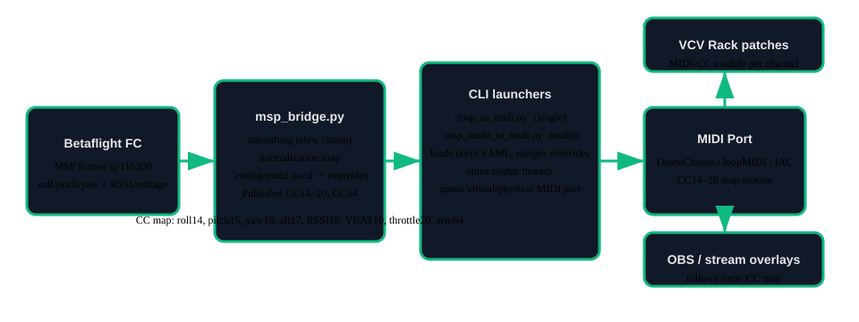

# Drone Chorus — Telemetry‑Driven Synth (VCV Rack Edition)

**Drone Chorus** turns FPV flight into **modulation you can hear**. We read Betaflight telemetry, smooth it into **MIDI CC** on a virtual port, and let a **VCV Rack** patch sing with it. Think of it as a polite feedback loop between **airframe dynamics** and **synth architecture**.



The diagram above keeps the signal chain honest: Betaflight MSP frames roll through `msp_bridge.py` for smoothing and normalization (the YAML in `config/` is the gospel), the CLI launchers (`msp_to_midi.py`, `msp_multi_to_midi.py`) light up a virtual/physical MIDI port, and CC14–20 plus CC64 ride into Rack patches or OBS overlays.

> No breadcrumbs? No problem. This README is the field manual. Open the playbooks below in order and you’ll know which script to run, which attenuverter to twist, and where the gremlins hide.

**Mission statement**: build performance systems that are safe, legible, and remixable. That means every README doubles as a zine. Expect callouts on safety, assumptions, and hardware quirks right next to the fun bits.

* * *

## How to tour this notebook (a.k.a. flight school)
1. **Control Stack Playbook** — soup‑to‑nuts wiring for the pilot rig: MSP→MIDI bridge, CC maps, and per‑drone channels.  
   See: `docs/CONTROL_STACK_PLAYBOOK.md`
2. **Safety Checklist** — punk‑rock preflight liturgy.  
   See: `docs/checklists/SAFETY.md`
3. **Experience Playbook** — rehearsal tactics, musical ranges, OBS scene switching.  
   See: `docs/EXPERIENCE_PLAYBOOK.md`
4. **Assumption Ledger** — what we’re assuming (and how we’ll be wrong).  
   See: `docs/ASSUMPTION_LEDGER.md`
5. **UX Map** — what the audience sees/hears and how controls surface near the patch edge.  
   See: `docs/UX_MAP.md`
6. **GUI Control Room Guide** — operating and customizing the PyQt6 dashboard.  
   See: `docs/GUI_CONTROL_ROOM.md`

Treat that order as gospel for newcomers: prototype → secure → rehearse → reflect → repeat.

* * *

## Why this repo
- **Rapid pilot → ensemble**: start with one whoop and one voice; scale to 2–8 drones mapped to channels.
- **Open & reproducible**: Betaflight + Python + VCV Rack; no black boxes.
- **Performance‑ready**: OBS scene collection ships with placeholders; relink and go.
- **Safety obsessed**: airspace, audience, and hearing protection are treated like first-class features.
- **Teaching-first**: every directory reads like a workshop handout so you can stand up a class or a club night without guessing.

* * *

## Repo layout
```
.
├─ config/                    # YAML maps (single & multi-drone)
├─ data/                      # README + generator for sample MSP logs
├─ docs/                      # Playbooks, ledger, UX map, mappings
├─ software/
│  └─ midi-bridge/            # MSP→MIDI (single + multi)
├─ vcv/                       # Starter patches (1‑ and 2‑drone)
├─ obs/                       # Scene collection (import + relink)
└─ scripts/                   # Launchers
```

* * *

## System snapshot (hardware + software stack)

| Layer | What you need | Why it matters |
| --- | --- | --- |
| **Flight hardware** | Betaflight-based quad or whoop with MSP over USB/UART, throttle cap, angle-mode preset. | Stable telemetry keeps the MIDI smoothing honest; the throttle cap prevents accidental prop carnage indoors. |
| **Ground station** | Laptop with Python 3.10+, audio interface or loopback device, and enough CPU headroom for VCV Rack. | The bridge and Rack patch run side by side—starve either and you’ll hear it. |
| **Control surface** | Optional MIDI controller or knobs in Rack. | Lets you mix human gestures with telemetry for hybrid performances. |
| **Audience rig** | OBS (or other broadcaster) plus monitor speakers or a PA with limiters. | Keeps levels under control and lets you document every run. |

If you’re missing actual aircraft, lean on the [telemetry captures](obs/telemetry/README.md) and the curated [sample logs](data/README.md); they were recorded for workshops and regression testing.

* * *

## Prereq: install Python before you launch anything
- **Stop and install Python 3.10+ first.** The MSP→MIDI bridge runs on Python, so handle that before trying the quickstart scripts.
- If you're not a coder (or just want a vibe-checked walkthrough), hit the [Setup Guide for Non-Coders](docs/SETUP_FOR_NONCODERS.md).

* * *

## Full software requirements (pin your environment)

1. **Python deps** — install via `pip install -r software/midi-bridge/requirements.txt` to get pinned versions of `mido`, `pyserial`, and `PyYAML`.
2. **VCV Rack 2** — Community edition works; load the starter patches and add your own modules.
3. **Virtual MIDI loopback** — macOS IAC, Windows loopMIDI, or Linux ALSA `snd-virmidi`. The scripts auto-create a virtual port on macOS/Linux; Windows users should add one manually.
4. **OBS 29+** — import the bundled scene collection for ready-to-roll streaming and recording.
5. **Optional analysis tools** — `socat` and PySerial’s `miniterm` for log replay, `midimon` or `MIDI Monitor` to visualize CC output.
6. **Optional beginner packaging path** — `./scripts/build_gui_binary.sh` builds a desktop app bundle via PyInstaller.
7. **Optional container path** — `software/midi-bridge/Dockerfile` for reproducible headless bridge runs.

Keep a `python -m venv .venv` around if you demo this for others; nothing tanks a workshop like conflicting site packages.

* * *

## Quickstart (single‑drone bench test)
1) **Betaflight**: Angle mode, throttle cap, failsafe; MSP enabled on your USB/UART.
2) **Deps**:
```bash
pip install -r software/midi-bridge/requirements.txt
```
3) **Run the one‑off bridge** (perfect for tuning a fresh quad or rehearsing solo):
```bash
python3 software/midi-bridge/msp_to_midi.py --serial /dev/ttyUSB0
```
   - Swap `/dev/ttyUSB0` for your actual rig — skim [Find your MSP port](docs/CONTROL_STACK_PLAYBOOK.md#find-your-msp-port) if you need a refresher on sniffing the right device.
   - Default MIDI port: a virtual **DroneChorus** device. Override with `--midi-port MyHardware --no-virtual` if you want to hit a physical DIN box.
   - Reuse the shared scaling map from `config/multi.yaml`; drop a YAML of tweaks via `--norm-overrides path/to/my_overrides.yaml`.
   - Optional safety hooks: `--throttle-limit 1500 --estop-file /tmp/drone_chorus.estop`.
4) **VCV Rack**: load `vcv/DroneChorus_Patch.vcv`, set the **Core MIDI‑CC** device to **DroneChorus**, Channel 1.
5) **Fine tune**: ride attenuverters; if you need deeper changes, clone `config/multi.yaml` and point `--norm-config` at your remix.

## Quickstart (multi‑drone, stage rig)
This is what you launch when you’re spinning up the full chorus—multiple craft, locked CC maps, each on its own channel.

```bash
./scripts/launch_multi.sh
```
- Edit `config/multi.yaml` (serial path per drone, 1‑based channel, optional `norm_overrides`).
- The launcher spawns one thread per entry, all sharing the same smoothing map.
- For higher drone counts, try the process-based prototype:
```bash
./scripts/launch_multi_mp.sh --config config/multi.yaml
```
- `runtime` lets you tune `poll_interval`/`idle_sleep` when scaling drone count.
- `publish_interval` (per drone) controls worker snapshot cadence in multiprocessing mode.
- `safety` adds bridge-level guardrails (`throttle_limit`, `estop_file`, `gate_threshold`).
- `signals` lets you remap CCs or add declarative MSP-derived telemetry fields.
- In Rack: instantiate one **MIDI‑CC** per drone and set channels 1..N.
- Load `vcv/DroneChorus_2Drones.vcv` as a template and keep scaling consistent.

### Bench playback cheat-sheet (per OS)
Prefer to rehearse with the quad unplugged? The canonical, platform-specific
recipes live under
[`software/midi-bridge/README.md`](software/midi-bridge/README.md#bench-playback-no-props-required).
Follow them with the bundled `obs/telemetry/bench_hover.mspbin` capture or the
rehydrated samples from `data/` and you’ll exercise the exact same MSP→MIDI
path the quickstart uses.

## MSP log replay pipeline (one command)

Need proof that the MSP→MIDI path works without props spinning? First, rebuild
the sample `.mspbin` captures (they live as base64 inside the repo to avoid
committing binaries):

```bash
python scripts/generate_sample_logs.py
```

Then pair the workshop logs in [`data/`](data/README.md) with the replay helper:

```bash
python examples/replay_log.py data/example_log_01.mspbin --verbose
```

That single command spins up a virtual **DroneChorus-Replay** MIDI port,
re-emits CC14–20 + CC64 in real time, and optionally dumps the normalized state
to stdout so you can watch altitude, voltage, and throttle move. Patch that
virtual port into VCV Rack (or your DAW) just like the live rig. Want to change
how the telemetry feels? Edit the `norm` section in `config/mapping.yaml`
(slews, ranges, curves) and re-run the command; it’s the fastest way to teach
students how scaling math translates into musical gesture.

* * *

## MIDI CC map (play it like an instrument tech)
| CC | Signal | Notes |
|---:|---|---|
| 14 | roll | feeds filters / wavetable scans |
| 15 | pitch | bends FM depth |
| 16 | yaw rate | leans into delay feedback |
| 17 | altitude | comes from `MSP_ALTITUDE`, falls back to a throttle → 0–3 m ramp if the craft ships without a baro |
| 18 | RSSI | keeps reverb honest |
| 19 | VBAT | nudges compression / tone |
| 20 | throttle | classic VCA fuel |
| 64 | arm gate | sustain-style hold for scene swaps |

The whole mapping is documented like a lab notebook: see
`docs/CONTROL_STACK_PLAYBOOK.md` for the long-form rationale, smoothing ranges,
and how to hack on the YAML. The quick headline is that altitude isn't left to
rot—if `MSP_ALTITUDE` packets arrive we publish meters directly; otherwise we
lean on throttle so CC17 still animates your patch.

* * *

## Safety checklist highlights (read before props spin)

- **Physical safety** — Follow the [Safety Checklist](docs/checklists/SAFETY.md). Indoors? Keep prop guards on, set throttle limits, and respect no-fly bubbles for the crew and audience.
- **Hearing safety** — Gain-stage inside Rack using the patch cards, then set hard limiters in OBS or your interface. No surprise feedback loops.
- **RF discipline** — Log every pack and channel in `logs/` so you can track interference trends and battery health.
- **Data hygiene** — Treat the bridge like a live instrument. Keep cables tidy, label USB ports, and document any ad-hoc tweaks in the pilot log.

Print the checklist and tape it to the flight case; we’re punk but not reckless.

* * *

## OBS
Import `obs/DroneChorus_SceneCollection.json`, then relink: **FPV Capture**, **VCV Rack (Window)**, **Program Audio**. Studio Mode recommended.

* * *

## Teaching / community toolkit

- Run through the repo tour above, then hand folks the [Experience Playbook](docs/EXPERIENCE_PLAYBOOK.md) for drills.
- Record each rehearsal in `logs/`—treat them as lab reports you can annotate later.
- Encourage learners to fork the YAML maps, tweak ranges, and PR back their favorite voicings.
- When in doubt, pair a newcomer with the telemetry playback flow so they can experiment without airspace stress.

* * *

## License
MIT for code, CC‑BY 4.0 for docs.
